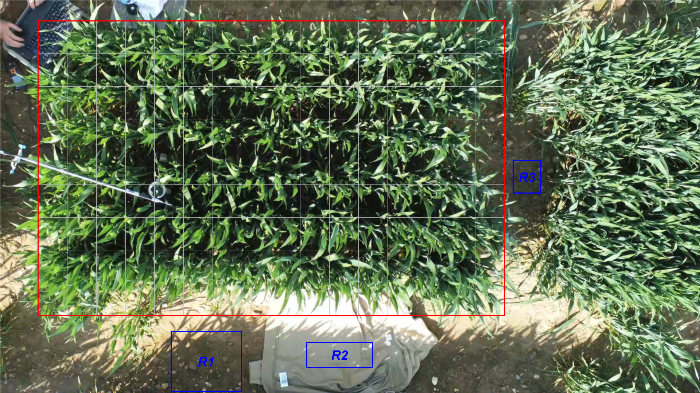
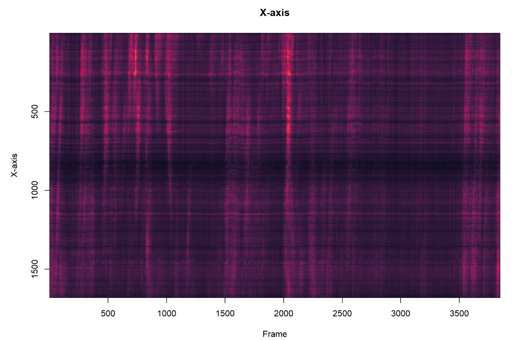

# framediff
Calculates quantity of motion from difference in pixel value between two frames in video. See more detailed description of methods in Rmarkdown file.

_Common usage:_  
```
inPath <- "C:/Users/[username]/folder/frames"
outPath <- "C:/Users/[username]/folder/output"

MakePos(inPath, outPath)
frameDiff(inPath, outPath, printit = FALSE)
```

## makePos
Writes .csv file with position of areas of interest. Requires `imager` package to draw rectangles for area of interest and 3 reference areas. Area of interest is then cut into 16x9 grid used by `zoneDefs`. 
At the end, print final picture from first frame with all areas marked. Do this before using frameDiff.
  

  
## frameDiff
Calculate quantity of motion from the difference in pixel value between two frame. Reference areas are used for normalization. The absolute pixel difference is computed and averaged for the three channels (red, green, blue). Variances for the three channels are added together.   
For every frame in the input folder, returns a line in a data frame with quantity of motion for all 23 zones, and reference areas. File `dfMeans.csv` gives the QOM from means, and `dfVar.csv` gives the QOM from variance (in my experience, much less susepetibel to automatic adjustment in brightness by the camera). `dfMGX` and `dfMGY` are motiongrams, done by calculating row (dfMGX) or column (dfMGY) means for every frame. 



## zoneDefs
Defines by defaults 23 zones within the frame for integration of quantity of motion, such as:
- 1: Whole frame  
- 2: Whole frame without edge (- 1 row/column)   
- 3: Edge only  
- 4: Left side (7x7)  
- 5: Right side (7x7)  
- 6: Left top left (3x3) [left side]  
- 7: Left top middle (3x3) [left side]  
- 8: Left top right (3x3) [left side]   
- 9: Middle middle left (3x3) [left side]  
- 10: Middle middle middle (3x3) [left side]  
- 11 Middle middle right (3x3) [left side]  
- 12: Left bottom left (3x3) [left side]  
- 13: Left middle left (3x3) [left side]  
- 14: Left bottom right (3x3) [left side]  
- 15: Left top left (3x3) [right side]  
- 16: Left top middle (3x3) [right side]  
- 17: Left top right (3x3) [right side]  
- 18: Middle middle left (3x3) [right side]  
- 19: Middle middle middle (3x3) [right side]  
- 20 Middle middle right (3x3) [right side]  
- 21: Left bottom left (3x3) [right side]  
- 22: Left middle left (3x3) [right side]  
- 23: Left bottom right (3x3) [right side]  


