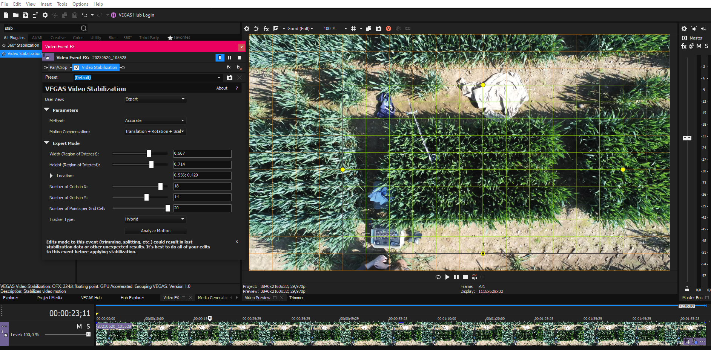
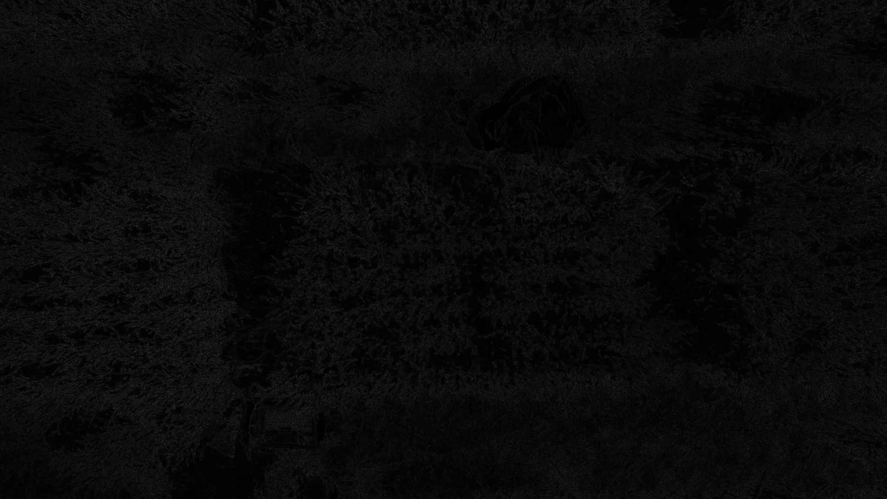
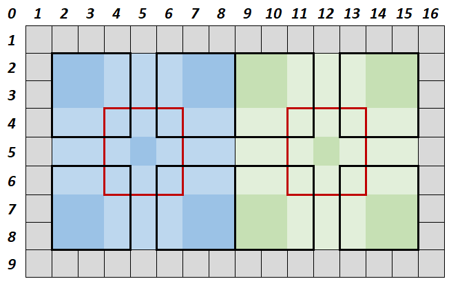
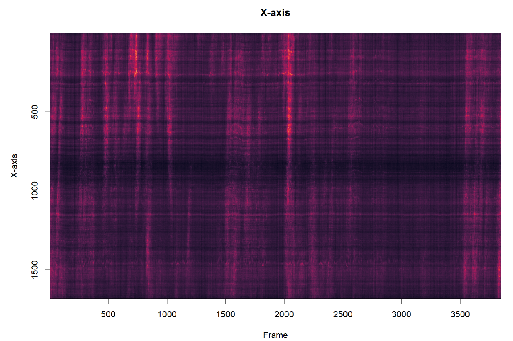
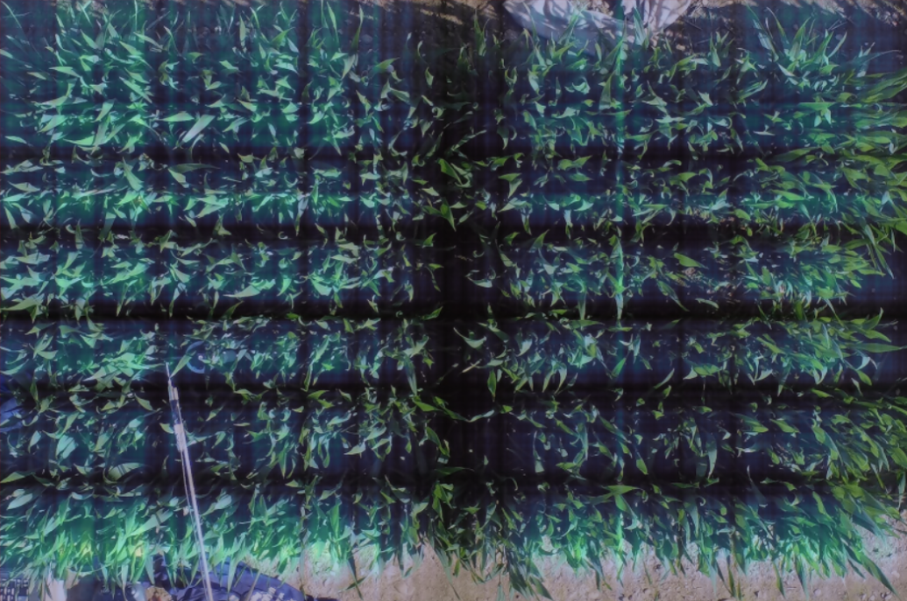

```{r, echo = FALSE, warning = FALSE, message = FALSE}
library(data.table)
library(imager)
library(viridis)
library(scales)
library(readxl)
```


## Method

*From videos recorded from a drone flying over wheat plot, motion in the plot was quantified by calculating the difference between frames.*  
  
***  
  
**Step 1: Stabilization** 

I used the stabilization pluging from Sony Vegas 21 to stabilize each video using the options as follow. The Frame was adjusted to contain the plot, and after the stabilization was done, additional rotation was applied to make sure the plot was levelled on the footage. 

  
  
***  
  
**Step 2: Frame-splitting**  

After stabilization was done, the video was rendered was a collection of frame, in the .png format, at the original resolution. Other methods of splitting frames either after rendering the stabilized video, or using a smaller picture format introduced compression artefacts and so were rejected. Below is an example of rendering the a video with the same exact settings. Artefacts appear in white.

  
  
***  
  
**Step 3: Calculating the frame difference**

Finally, each frame was imported in R, and the absolute difference between frame in pixel value for each channel (red, green, blue) was calculated. I used the absolute difference because motion by leaves is as much the result of leaves moving *away from* a pixel, as it is from leaves moving *into* a pixel (although both are saved independently in an excel file). The value calculated for each channel is bounded between 0 and 1. 0 means absolutely no difference between frame, 1 means absolute difference (e.g. from pure black to pure white). This makes comparison between videos easier, as the value is normalized by default.  
  
*Here is an example for the frame difference over the actual video. The video is darkened to see motion better, and positive and negative differences (averaged for the 3 color channels) are shown respectively in red and green:*  

<video width="800" height="450" controls>
  <source src="5svid_movement_withColours.mp4" type="video/mp4">
</video>
  
***  
  
**Step 4: Quantity of motion**  

Within an area of interest (e.g. the plot area), the difference in pixel value between frame will grow larger the more plant move with the wind (as we can see in the video above). Then, the variance (and mean) of this difference will be proportional to canopy motion. I summed the variance of this difference in the red, green and blue channel for each frame. I found the variance to be less susceptible to artefacts e.g. from brightness adjustment by the drone.Below is an example for KWSKinetic.

* **The means show a regular artifact which is due to the camera regularly modulating the brightness. This can be corrected by calculating the mean frame difference on a reference area on which no movement is suppose to happen (e.g. flat ground).**
```{r, echo = FALSE}
dfV <- fread(paste0("C:/Users/duran/Dropbox/Work/Data2023/WindWheatUK/UAV/output/20230520/KWSKinetic/20230520_115111/dfVar.csv"))
dfM <- fread(paste0("C:/Users/duran/Dropbox/Work/Data2023/WindWheatUK/UAV/output/20230520/KWSKinetic/20230520_115111/dfMeans.csv"))

dfV$frame <- 1:nrow(dfV)
dfM$frame <- 1:nrow(dfM)
dfV$time <- (dfV$frame-1)/30
dfM$time <- (dfM$frame-1)/30

setDF(dfV) ; setDF(dfM)
dfV$RM <- rowMeans(dfV[,c("R1", "R2", "R3")])
dfM$RM <- rowMeans(dfM[,c("R1", "R2", "R3")])

plot(z2 ~ time, dfM, type = "l", col = "darkblue", ylim = c(0,0.045), ylab = "Quantity of motion (means)", xlab = "Time (s.)", cex.lab = 1.4, font.lab = 2)
points(RM ~ time, dfM, type = "l", col = "royalblue", ylab = "Quantity of motion (arb. units)", xlab = "Time (s.)", cex.lab = 1.4, font.lab = 2)
legend("topleft", bty  = "n", legend = c("Means", "Reference"), fill = c("darkblue", "royalblue"))
```

* **The does not show this same artifact, although it is a good idea to still use a reference zone where no motion occur.**
```{r, echo = FALSE}
plot(z2 ~ time, dfV, type = "l", col = "red", ylim = c(0,0.017), ylab = "Quantity of motion (arb. units)", xlab = "Time (s.)", cex.lab = 1.4, font.lab = 2)
points(RM ~ time, dfV, type = "l", col = "darkred", ylab = "Quantity of motion (variances)", xlab = "Time (s.)", cex.lab = 1.4, font.lab = 2)
legend("topleft", bty  = "n", legend = c("Variances", "Reference"), fill = c("red", "darkred"))
```

* **Comparing the corrected data using means or variances, both look very similar, but variances are generally less noisy, and therefore were the index used to quantify motion.**
```{r, echo = FALSE}
plot(z2-RM ~ time, dfM, type = "l", col = "darkblue", ylim = c(0,0.03), ylab = "Quantity of motion (arb. units)", xlab = "Time (s.)", cex.lab = 1.4, font.lab = 2)
points(z2-RM ~ time, dfV, type = "l", col = "red", ylab = "Corrected quantity of motion (arb. units)", xlab = "Time (s.)", cex.lab = 1.4, font.lab = 2)
legend("topleft", bty  = "n", legend = c("Means", "Variances"), fill = c("darkblue", "red"))
```
  
***  
  
**Step 5: Areas of interest**  

The process is long. On my home computer, it takes a 7-8s per frame, but each video contain 3600 frames (2 min) which results in 7-8h per video. Therefore all calculations have to be done once, because re-processing all will take ~300h. The zone of interest is defined by drawing a rectangle on the frame and drawing three additional reference zones on the flat ground near the plot. The zone of interest is further divided in 144 rectangles (16*9) as seen below. If the  area of interest is perfectly in 16x9, the rectangles become squares. The rectangles almost squares, and because they are a proportion of the area of interest, they represent a similar plot area in each video. 


The rectangles are used to define 23 separate zones. First the whole area, the border area (outer layer of squares), and the within area (excluding the border) are separated. Then, for each half (blue and green), the whole zone is recorded, as well as 9 overlapping squares within it, as shown in the picture below using borders and different color brightness.  


  
***  
  
**Step 6: Motiongrams**  

The time-series of motion can be further decomposed by averaging for each frame in the X and Y-axis (and subtracting the value in the references), which create motiongrams. 



The bright vertical lines show moments where wind gust happens and canopy moved the most. Note how the lines do appear quite vertical which show motion travelling through the frame. As we can see in the example below, there are areas where generally less motion happen (middle in the X-axis, several lines in the Y-axis). 

*While averaging the pixel value for the X or Y-axis result in the time-series of means shown above, averaging over the duration of the time series gives us locations is X/Y where movement happens more often. By calculating the dot-product of the vectors,* **we can recreate a map of canopy motion:**

```{r, echo = FALSE, warning = FALSE}
path <- "C:/Users/duran/Dropbox/Work/Data2023/WindWheatUK/UAV/output/20230520/KWSKinetic/"
vid <- "20230520_115111/"

dfPos <- fread(paste0(path, vid, "dfPos.csv"))
dfM <- fread(paste0(path, vid, "dfMeans.csv"))
dfV <- fread(paste0(path, vid, "dfVar.csv"))
dfMX <- read.csv(paste0(path, vid, "dfMGX.csv"))
dfMY <- read.csv(paste0(path, vid, "dfMGY.csv"))

## Corrections and normalization
dfM$frame <- 1:nrow(dfM)
dfV$frame <- 1:nrow(dfV)

# Correct means with reference
dfM$RM <- rowMeans(dfM[,c("R1", "R2", "R3")])
dfV$RM <- rowMeans(dfV[,c("R1", "R2", "R3")])

setDF(dfM) ; setDF(dfV)
zones <- c("z1", "z2", "z3", "z4", "z5", "z6", "z7", "z8", "z9", "z10", "z11", "z12", "z13", "z14", "z15", "z16", "z17", "z18", "z19", "z20", "z21", "z22", "z23")
for(i in zones)
{
  dfM[,i] <- dfM[,i] - dfM[,"RM"]
  dfV[,i] <- dfV[,i] - dfV[,"RM"]
}
setDT(dfM) ; setDT(dfV)

# Correct motiongrams a posteriori with reference
mxn <- matrix(rep(dfM$RM,nrow(dfMX)), ncol = ncol(dfMX), byrow = T)
myn <- matrix(rep(dfM$RM,nrow(dfMY)), ncol = ncol(dfMY), byrow = T)
mx <- (as.matrix(dfMX) / nrow(dfMY)) - mxn
my <- (as.matrix(dfMY) / nrow(dfMX)) - myn

## plot them
mgx <- as.cimg(c(unlist(t(mx))), x = ncol(mx), y = nrow(mx))
mgy <- as.cimg(c(unlist(t(my))), x = ncol(my), y = nrow(my))

x <- c(apply(mgx, 2, mean))
y <- c(apply(mgy, 2, mean))
xm <- matrix(x, nrow = 1)
ym <- matrix(y, ncol = 1) 
h <- ym %*% xm
himg <- as.cimg(c(unlist(t(h))), x = length(x), y = length(y))

cscale <- scales::gradient_n_pal(turbo(101), seq(0,1,0.01))
plot(himg, interpolate = FALSE, rescale = TRUE, colourscale = cscale, main = "heatmap of likeliness of movement")
```

This map clearly shows that motion does not happen uniformly in the plot. It is dependent on border effect, and the planting lines are  clearly visible as well. 


